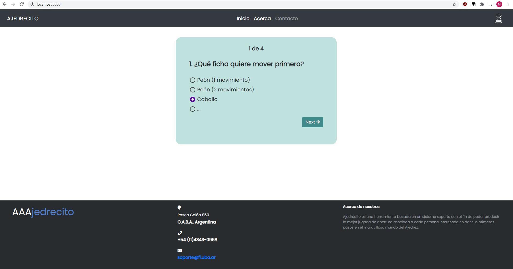

# T.P. Fallas 1

## Pasos para correr el código:

1- Instalar docker

2- Correr el comando `make run`

3- Acceder al servidor local en el puerto especificado según diga en la consola (EJEMPLO: http://127.0.0.1:5000/ ).

